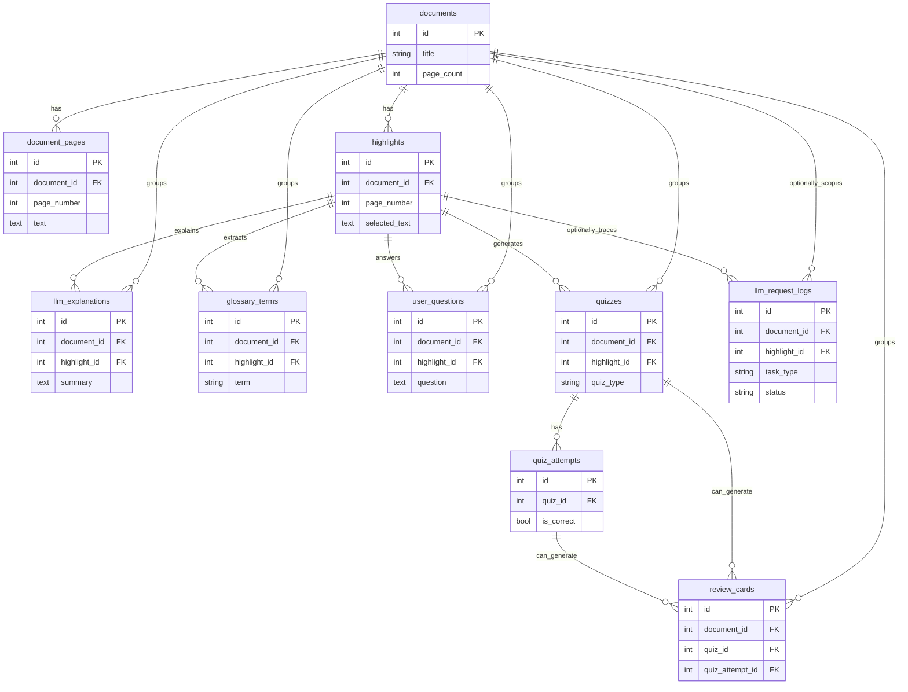
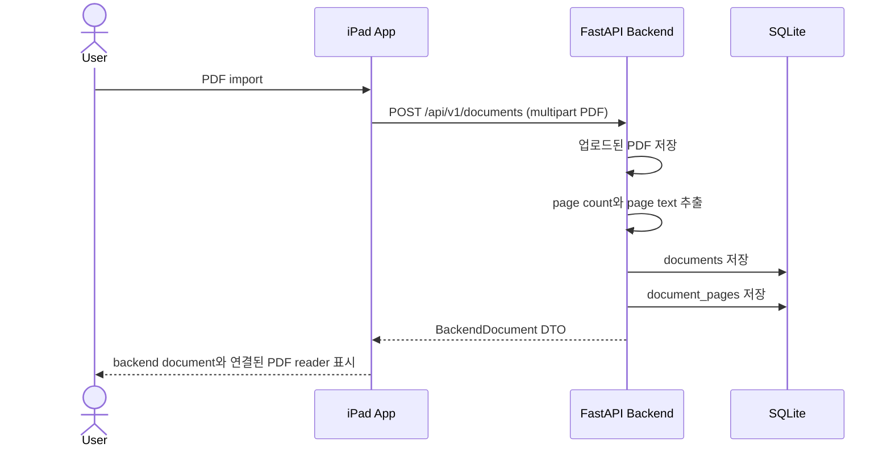
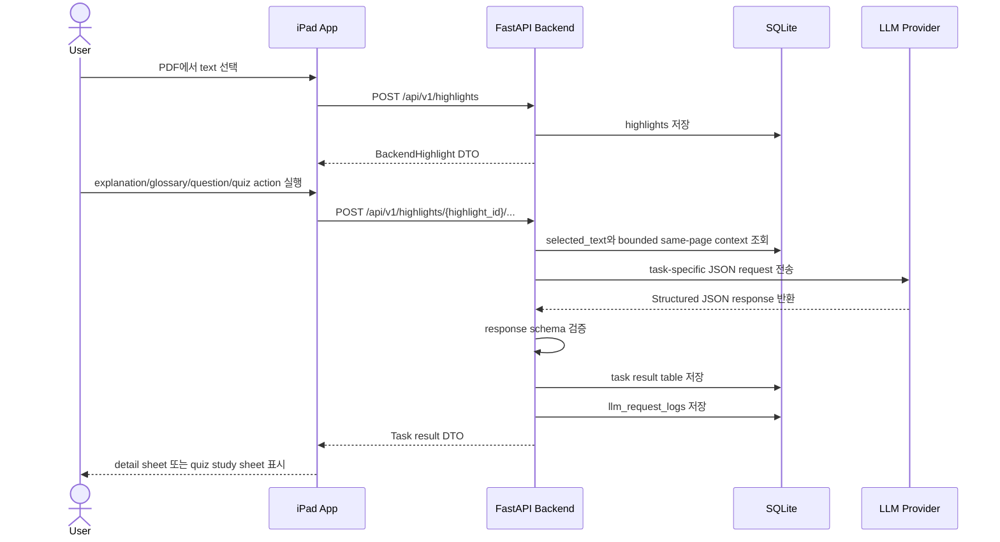
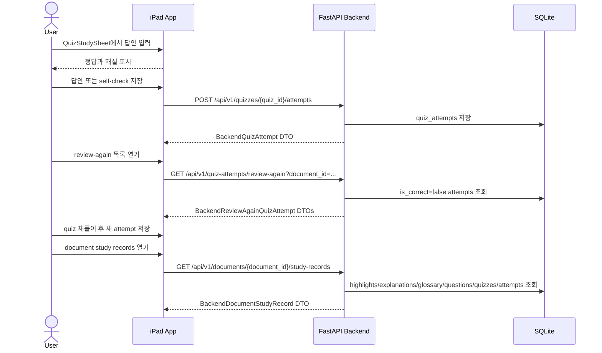

# InfoDrip Architecture

## 1. 개요

InfoDrip은 iPad App, FastAPI Backend, SQLite, LLM API로 구성된 local-first PDF 학습 보조 앱이다.

| Layer | Responsibility |
| --- | --- |
| iPad App | PDF import, PDFKit 기반 reading, selected text quick action, quiz study/replay UI |
| FastAPI Backend | PDF upload/storage, page text extraction, 구조화된 학습 기록 저장, LLM provider 호출 |
| SQLite | `documents`, `highlights`, `quizzes`, `quiz_attempts` 등 학습 기록 저장 |
| LLM API | explanation, glossary extraction, question answering, quiz generation 수행 |

핵심 설계 방향:

- **Selected-text 중심:** 전체 PDF 대상 chatbot이 아니라 선택 영역 기반 학습 흐름을 제공한다.
- **보안 및 책임 분리:** iPad App에는 LLM API key를 저장하지 않고, LLM provider/API 호출은 backend가 담당한다.
- **Context 제한:** 매 요청마다 full PDF text를 보내지 않고 selected text와 bounded same-page context만 사용한다.
- **Quiz/review 흐름 분리:** quiz attempt는 `quiz_id` 기반으로 저장하고, review-again은 `is_correct=false` `quiz_attempts` 기반으로 동작한다.

## 2. 핵심 데이터 모델

| Table | Role |
| --- | --- |
| `documents` | 업로드된 PDF의 document metadata, original filename, storage path, page count를 저장한다. |
| `document_pages` | backend가 PDF에서 추출한 page별 text를 `documents`에 연결해 저장한다. |
| `highlights` | iPad에서 선택한 `selected_text`와 page number를 document 단위로 저장한다. |
| `llm_explanations` | `highlights` 기반 explanation summary와 key points를 저장한다. |
| `glossary_terms` | `highlights` 기반 glossary term, definition, optional source text를 저장한다. |
| `user_questions` | `highlights`에 대해 사용자가 입력한 question과 LLM answer/evidence를 저장한다. |
| `quizzes` | `highlights` 기반 generated quiz를 저장하며 MVP quiz type은 `short_answer`, `fill_blank`다. |
| `quiz_attempts` | 사용자의 quiz answer, self-check result, optional feedback을 저장하고, `is_correct=false` attempt를 review-again 대상으로 조회한다. |
| `review_cards` | wrong quiz attempt에서 review card를 생성하는 backend/API capability다. 별도 review card list/detail/edit/delete UX는 보류되어 있다. |
| `llm_request_logs` | LLM task별 provider, model, token usage, latency, status, estimated cost, sanitized error를 기록한다. |

Primary review UX는 `review_cards`가 아니라 `quiz_attempts` 중심이다.

사용자가 quiz study sheet에서 답을 입력하고 answer reveal 후 self-check를 저장하면, `is_correct=false` attempt가 review-again listing/replay 대상이 된다.

Document-level study record는 highlights, explanations, glossary terms, questions, quizzes, attempts를 한 번에 조회한다.

## 3. ERD

아래 ERD는 모든 ORM relationship을 그대로 나열한 것이 아니라, table 간 FK와 workflow상 추적 관계를 중심으로 단순화한 관계도다.

`llm_request_logs`는 LLM result table에 직접 FK를 두지 않는다.

실제 추적 경계는 `document_id`, `highlight_id`, `task_type`, `created_at`이며, task 결과 table(`llm_explanations`, `glossary_terms`, `user_questions`, `quizzes`, `review_cards`)과 같은 `highlight` context에서 운영상 연결된다.

`llm_request_logs.document_id`와 `highlight_id`는 nullable이며, selected-text LLM task에서는 document/highlight context를 함께 기록한다.

## 4. 주요 API 흐름

### 4.1 PDF upload / page text extraction

### 4.2 Selected text quick action

### 4.3 Quiz study / review-again / study records

## 5. 구현 상태

### Implemented

- document upload/page extraction, backend PDF storage, `documents`/`document_pages` 저장 구조를 구현했다.
- highlight create/list API와 iPad selected-text quick actions를 구현했다.
- structured response validation과 `llm_request_logs` 기록을 포함한 explanation/glossary/question/quiz generation을 구현했다.
- quiz attempt tracking, answer reveal/self-check flow, review-again listing/replay를 구현했다.
- document-level study records API와 iPad study record sheet를 구현했다.
- `is_correct=false` quiz attempt 기반 backend/API review card generation/listing capability를 구현했다.

### Deferred / Planned

- page range quiz, exam mode, learning-goal-based quiz generation, advanced/deep mode는 MVP 이후로 보류했다.
- separate review card list/detail/edit/delete UX는 보류했다.
- delete API/UI와 DB migration strategy 정리는 후속 작업으로 남겼다.
